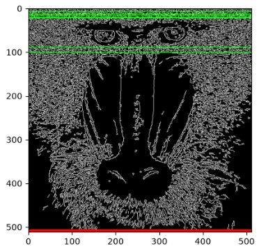
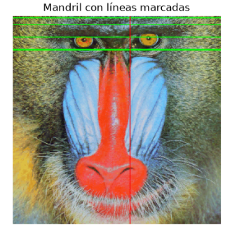
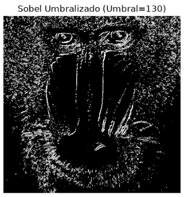
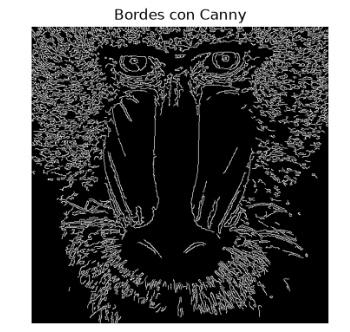

# Práctica 2: Modificación de Imágenes, Detección de Bordes e Interacción por Movimiento

**Autor:** Mencey Montesdeoca Álamo  
**Asignatura:** Visión por Computador  

---

##  Descripción
Este repositorio contiene el desarrollo de la segunda práctica de Visión por Computador, centrada en el procesamiento básico de imágenes, detección de bordes y el desarrollo de un prototipo interactivo en tiempo real basado en detección de movimiento.

---

## Tareas Desarrolladas

### Tarea 1: Superposición de Formas y Filtrado por Umbral
* **Descripción:** Procesamiento de figuras geométricas sobre las imágenes proporcionadas.
* **Aportación:** Se implementó un filtro para representar únicamente aquellos elementos que superan un umbral de intensidad mínimo predefinido.
* **Resultado:**
  

---

### Tarea 2: Análisis Comparativo de Bordes (Sobel vs Canny)
* **Descripción:** Evaluaciónde dos operadores clásicos de detección de bordes: el filtro de Sobel y el detector de Canny.
* **Metodología y Análisis:** Comparación visual de las densidades de píxeles de borde detectadas bajo distintas condiciones de iluminación y textura.
* **Resultados:**
  | Imagen Original | Sobel | Canny |
  | :---: | :---: | :---: |
  |  |  |  |

---

### Tarea 3: Air Guitar por Visión Artificial (Prototipo Interactivo)
* **Descripción:** Aplicación interactiva en tiempo real inspirada en el concepto de *Air Guitar*. La imagen de la cámara se divide en dos regiones activas:
  * **Zona izquierda:** Rango de frecuencias graves.
  * **Zona derecha:** Rango de frecuencias agudas.
* **Funcionamiento:** Se calcula la diferencia entre fotogramas consecutivos (o mapa de movimiento). La posición donde haya movimiento determina la frecuencia generada, mostrando en pantalla un aviso visual con la frecuencia exacta emitida.

---

## Requisitos y Ejecución

### Dependencias
Para ejecutar este cuaderno se requieren las siguientes librerías: pillow
